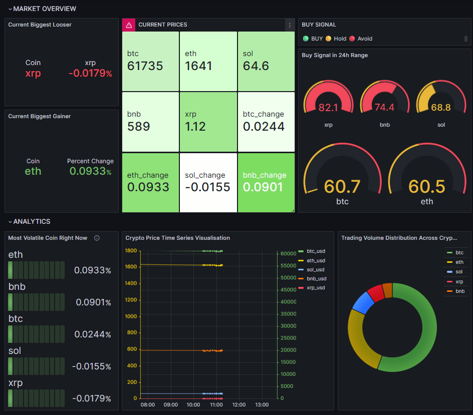

# 📈 Dockerized Crypto Price Tracker

A fully containerized real-time cryptocurrency price pipeline that fetches, stores, and visualizes live market data for 5 major cryptocurrencies using CoinGecko API, Apache Airflow, MySQL, and Grafana.

---

## 🚀 Tech Stack

| Tool | Purpose |
|------|---------|
| Python | Fetch data from CoinGecko API |
| Apache Airflow | Schedule DAG every 5 minutes |
| MySQL | Store price data |
| Grafana | Live dashboard visualizations |
| Docker Compose | Orchestrate all services |

---

## 📊 Dashboard Preview



### Visualizations
- **Market Overview** — Current prices, biggest gainer/loser, buy signal gauges
- **Buy Signal Score** — Gauge showing where each coin sits in its 24h high/low range
- **Most Volatile Coin** — Bar gauge ranked by 24h price change %
- **Trading Volume Distribution** — Pie chart showing volume share across coins
- **Price Time Series** — Historical price trends for all 5 coins

---

## 🪙 Tracked Coins
- Bitcoin (BTC)
- Ethereum (ETH)
- Solana (SOL)
- BNB
- XRP

---

## ⚙️ How It Works

```
CoinGecko API (free, no signup)
        ↓
Airflow DAG runs every 5 minutes
        ↓
Fetches BTC, ETH, SOL, BNB, XRP prices
        ↓
Stores in MySQL (price, volume, 24h high/low, % change)
        ↓
Grafana dashboard visualizes live data
```

---

## 🛠️ Setup

### 1. Clone the repo
```bash
git clone https://github.com/arishaprasain/crypto-price-tracker.git
cd crypto-price-tracker
```

### 2. Create your `.env` file
```bash
cp .env.example .env
```
Fill in your own values in `.env`.

### 3. Start all services
```bash
docker compose up -d
```

### 4. Create the MySQL table
Connect to MySQL and run:
```sql
USE crypto_tracker;

CREATE TABLE prices (
    id INT AUTO_INCREMENT PRIMARY KEY,
    coin VARCHAR(20),
    price_usd DECIMAL(20, 2),
    high_24h DECIMAL(20, 2),
    low_24h DECIMAL(20, 2),
    price_change_pct DECIMAL(10, 4),
    volume_24h DECIMAL(30, 2),
    fetched_at DATETIME
);
```

### 5. Add Airflow MySQL Connection
1. Open `http://localhost:8080` (login: admin/admin)
2. Go to **Admin → Connections → +**
3. Fill in:
   - Connection Id: `crypto_mysql`
   - Connection Type: `MySQL`
   - Host: `crypto-mysql`
   - Schema: `crypto_tracker`
   - Login: `root`
   - Password: your MySQL password
   - Port: `3306`

### 6. Enable the DAG
In Airflow UI toggle **crypto_price_tracker** ON.

### 7. Import Grafana Dashboard
1. Open `http://localhost:3000` (login: admin/admin)
2. Go to **Dashboards → Import**
3. Upload `grafana/dashboard.json`

---

## 📁 Project Structure

```
crypto-price-tracker/
├── docker-compose.yml
├── .env.example
├── .gitignore
├── dags/
│   └── crypto_dag.py
└── grafana/
    └── dashboard.json
```

---


